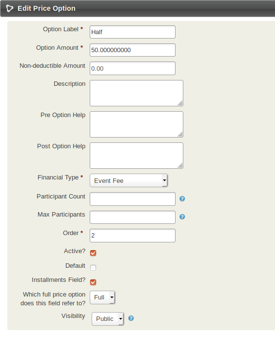
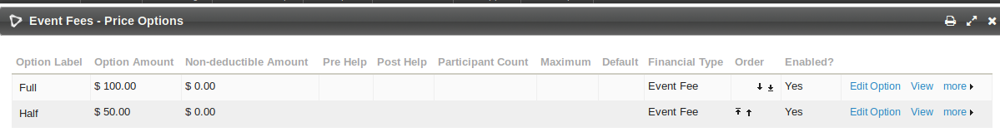
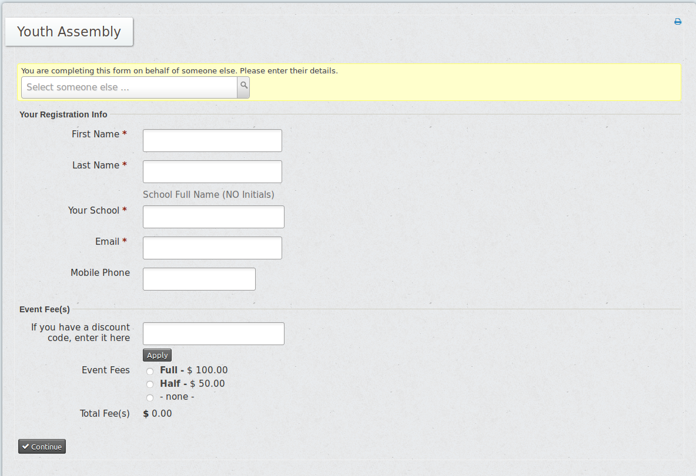

# com.aghstrategies.partialeventpayment

1. Adds two fields to the Price Option Form:
 - An installments field checkbox: checking this checkbox will show the the second price field.
 - A Select for "Which full price option does this field refer to?" - whichever field is selected for this field will be the field that this price option will be configured to be a partial payment towards.

 These fields are used to create price fields with an option to pay the whole amount up front or put down a deposit. See Screenshot below:  
  

2. On event Registration forms using price sets for which partial payments have been configured (on the price options), creates a partially paid registration if the partial payment option is selected.

Abstracted from [warriorpartialevents](https://git.aghstrategies.com/clients/weekend-warriors/warriorpartialevents)

## To use this Extension
Configure a price set with a radio price field with a full option and whatever partial options you would like. You will have to first create all the price options like so:

  

and then go back and edit the one you would like to be partial so that the "Installments field?" checkbox is checked and the "Which full price option does this field refer to?" to be the full option.

  

When this price set is used for a front facing event it should result in a Event Fees section that looks like:

  

Where if the user selects the Half option a partially paid event registration is made for them.  They will have paid $50 of the $100 event registration fee
